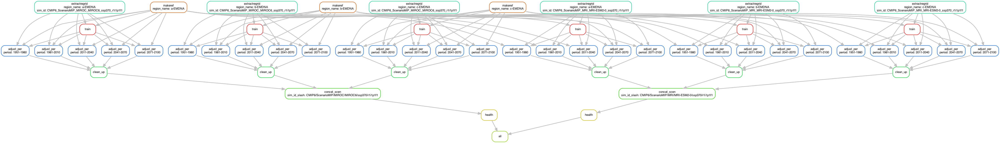

# info-crue-cmip6

Instructions: 
1) On narval, build a virtual env:

```bash
$ module load StdEnv/2023 gcc openmpi python/3.12.4 arrow/18.1.0 openmpi netcdf proj esmf/8.7.0 geos mpi4py/4.0.3 ipykernel/2025a scipy-stack/2024a nodejs
$ cd <PATH_ENV_DIR>
$ virtualenv --no-download mbcn-staked
$ source mbcn-staked/bin/activate
$ pip install --no-index --upgrade pip
$ pip install --no-index -r requirements.txt
$ echo "module load StdEnv/2023 gcc openmpi python/3.12.4 arrow/18.1.0 openmpi netcdf proj esmf/8.7.0 geos mpi4py/4.0.3 ipykernel/2025a scipy-stack/2024a nodejs" > mbcn-staked/bin/modules
```
 or just activate it: `pyact mbcn-staked`

2) Specify the `sim_id` wanted in the `Snakefile`. 

3) Create your own `config/paths.yml` based on `paths-template.yml`.

4) Modify `config/config.yml` to reflect method wanted (correct tasmin or dtr, reference dataset, time grouping, region)

5) If needed, personalize the `simple/config.v8+.yaml` for the right slurm parameters.

6) Run the workflow:

```bash
$ snakemake --profile simple
```

7) Run `inspection.ipynb` to make sure all looks good.

Snakemake should build a dag that looks like this for 1 simulation: 
